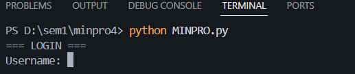
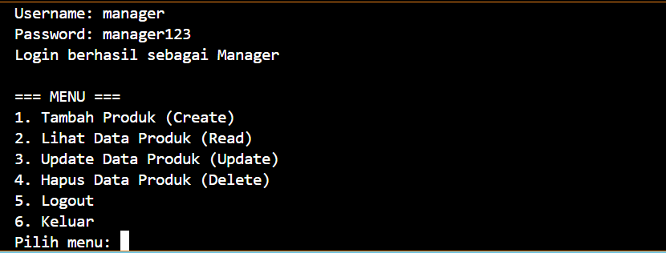
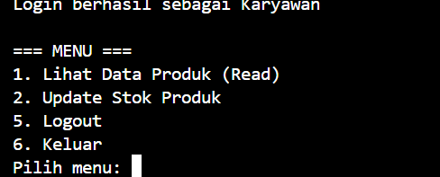

# MINPRO - Data Produk Online Shop 

Program Python sederhana buat ngatur data produk dengan sistem login Manager sama Karyawan.

## Deskripsi Project

Aplikasi CRUD basic yang bikin kita bisa kelola produk di terminal. Ada dua role:
- **Manager**: Bisa (tambah, edit, hapus produk)
- **Karyawan**: Cuma bisa liat produk sama update stok

## Cara Pakai

1. Pastiin Python udah install
2. Download file `MINPRO.py`
3. Jalankann di terminal:
```bash
python MINPRO.py
```


## Login Info

**Manager:**
- Username: `manager`
- Password: `manager123`



**Karyawan:**
- Username: `karyawan` 
- Password: `karyawan123`


  

## Fitur

### Manager bisa:
- Tambah produk baru
- Liat semua produk
- Edit produk (nama, kategori, harga, stok)
- Hapus produk

  

### Karyawan bisa:
- Liat produk
- Update stok

 

## Data Produk

Tiap produk punya:
- Kode produk (ID unik)
- Nama
- Kategori  
- Harga
- Stok

  

## Catatan

- Data Tersimpan di saat running aja, jadi kalau program ditutup data hilang
- Ada error handling untuk input yang salah
- Interface hanya text-based

## Info

Aura Putri Anandita Syarif (2509116094) - Sistem Informasi

---

